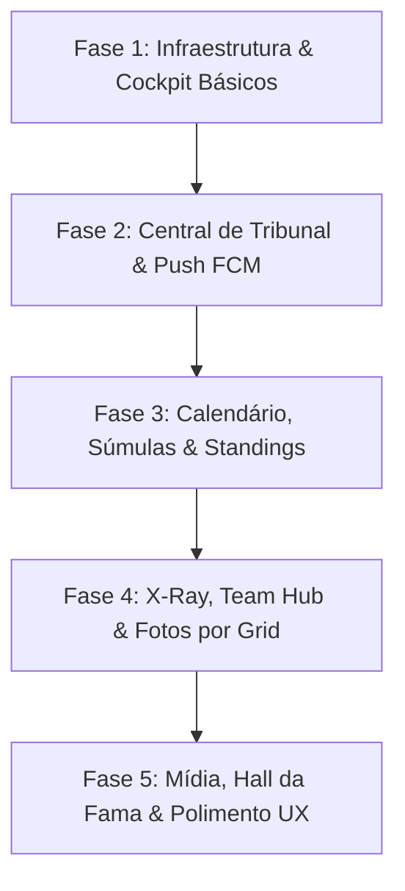

# Plano de Implantação e Arquitetura do App Mobile - FullGas League

Este documento define a estratégia completa de implantação, arquitetura de menus e roteiro de desenvolvimento do aplicativo mobile para pilotos da **FullGas League**.

---

## 1. Arquitetura de Navegação e Estrutura de Menus

Sim, toda a experiência do piloto no aplicativo será organizada através de uma **estrutura moderna de menus mobile**, dividida em **5 Abas Principais (Bottom Navigation)** e **Telas Contextuais (Sub-menus)**.

```
┌────────────────────────────────────────────────────────────────────────┐
│                        FULLGAS LEAGUE MOBILE                           │
├──────────────┬──────────────┬──────────────┬──────────────┬────────────┤
│  🏠 Home     │  🏁 Corridas │  ⚖️ Tribunal  │ 🏆 Standings │ 👤 Perfil  │
│  (Cockpit)   │ (Calendário) │ (Ouvidoria)  │  & Equipes   │  & Config  │
└──────────────┴──────────────┴──────────────┴──────────────┴────────────┘
```

### Detalhamento dos Menus e Sub-menus

#### 1. 🏠 Aba 1: Home (Cockpit do Piloto)
- **Menu Principal**: Visão consolidada e rápida das informações essenciais antes da corrida.
- **Conteúdos e Ações**:
  - **Banner de Próximo GP**: Nome do GP, data, pista e contagem regressiva.
  - **Botão de Check-in Rápido**: 1 toque para confirmar presenca ou justificar ausência.
  - **Card de Lastro Atual**: Indicação do carro alocado para a próxima prova (ex: *Cadillac #1*).
  - **Medidor Visual de CNH**: Barra colorida mostrando pontuação (25 pnts) e badge de status.
  - **Alerta de Quali Ban / Punição**: Notificação em destaque caso o piloto esteja suspenso do treino classificatório.

#### 2. 🏁 Aba 2: Corridas & Calendário
- **Menu Principal**: Calendário completo de todas as etapas da temporada ativa.
- **Sub-menus e Telas Detalhadas**:
  - **Ficha/Briefing da Etapa**: Clima previsto, temperatura, tamanho do grid, assistências permitidas no lobby, ID da sala e host responsável.
  - **Súmula Detalhada pós-GP (Estilo Overtake F1)**: Posicao de largada vs chegada, stints de pneus executados (ex: *Macio ➔ Médio*), melhor volta, tempo da qualy, pit stops e penalidades em pista.

#### 3. ⚖️ Aba 3: Tribunal Virtual (Ouvidoria de Incidentes)
- **Menu Principal**: Central de acompanhamento de protestos ativos e concluídos.
- **Sub-menus e Telas Detalhadas**:
  - **Tela de Defesa (Defesa de Protesto)**: Notificação instantânea ao ser acusado, exibição do vídeo do acusador (player integrado), indicação do minuto e formulário para enviar vídeo de defesa e justificativa.
  - **Abrir Novo Protesto**: Formulário simplificado para selecionar o GP recente, piloto acusado (com foto/nickname), link de vídeo e minutagem.
  - **Timeline do Protesto**: Acompanhamento do status (*Aguardando Defesa ➔ Em Votação ➔ Veredito Publicado*).
  - **Extrato da CNH**: Histórico detalhado de perda/ganho de pontos da CNH.

#### 4. 🏆 Aba 4: Classificação & Equipes
- **Menu Principal**: Tabelas do campeonato por Grid ativo.
- **Sub-menus e Telas Detalhadas**:
  - **Classificação de Pilotos & Construtores**: Navegação entre grids, filtro Titulares/Reservas e indicador de subida/descida de posição (`▲ +2`, `▼ -1`).
  - **Comparativo Head-to-Head (X-Ray)**: Comparação direta entre o piloto e seu rival ou colega de equipe (Poles, Vitórias, Posição média de chegada).
  - **Central da Equipe (Team Hub)**: Integrantes da escuderia, fotos oficiais e total de pontos no campeonato de construtores.

#### 5. 👤 Aba 5: Perfil & Mais
- **Menu Principal**: Gerenciamento de conta do piloto e recursos adicionais da liga.
- **Sub-menus e Telas Detalhadas**:
  - **Gerenciador de Fotos por Grid**: Upload de fotos de perfil gerais e fotos específicas por categoria (capacete/macacão do Grid Elite, Pro, etc.).
  - **Editar Dados do Perfil**: Atualização de Nickname, Nome Real, Senha e WhatsApp.
  - **Central de Notificações**: Histórico de alertas push recebidos e configuração de preferências de avisos.
  - **Mural de Notícias & Hall da Fama**: Matérias da liga e galeria dos campeões históricos.

---

## 2. Fases de Implantação (Roadmap do Projeto)

O projeto será implementado em **5 Fases progressivas**, garantindo que o piloto tenha funcionalidades úteis desde as primeiras entregas.



---

### 🚀 FASE 1: Infraestrutura Básica, Autenticação e Cockpit do Piloto
**Foco**: Entregar o aplicativo funcional com login e check-in de corridas em 1 toque.

- **Tarefas de Front-end (App Mobile)**:
  - Configuração do projeto Expo React Native e rotas de navegação (Bottom Tabs).
  - Tela de Login com token JWT e salvamento local seguro.
  - **Tela 🏠 Home (Cockpit)**:
    - Card da próxima corrida com botão de Check-in em 1 toque (Confirmar / Justificar Ausência).
    - Exibição do veículo de lastro atribuído ao piloto.
    - Barra visual de status da CNH (25 pnts).
    - Banner de alerta em caso de Quali Ban.
- **Tarefas de Back-end (API Flask)**:
  - Ajustar endpoint `/api/login` para retornar FCM Token e dados completos do perfil.
  - Ajustar `/api/next-race` e `/api/checkin` para suporte completo mobile.
  - Garantir cálculo do veículo de lastro na rota `/api/profile`.

---

### ⚖️ FASE 2: Central de Tribunal Virtual & Push Notifications (FCM)
**Foco**: Notificar pilotos em tempo real sobre incidentes e permitir defesa pelo celular.

- **Tarefas de Front-end (App Mobile)**:
  - **Aba ⚖️ Tribunal**:
    - Lista de protestos abertos em que o piloto é acusador ou acusado.
    - Timeline visual do status do julgamento.
  - **Tela de Defesa do Protesto**:
    - Player de vídeo (YouTube) embutido para assistir ao lance alegado.
    - Formulário para submeter link do vídeo de defesa e argumento.
  - **Tela de Abertura de Protesto**:
    - Formulário interativo para selecionar o GP e piloto acusado.
  - **Extrato Completo da CNH**:
    - Lista com histórico de infrações, penalidades e recuperação de pontos.
- **Tarefas de Back-end (API Flask)**:
  - Implementar rotas `/api/protests` (listar, abrir protesto, enviar defesa).
  - Integrar envio automático de notificações push via **Firebase Cloud Messaging (FCM)** para:
    - Alerta de novo protesto recebido.
    - Alerta de veredito publicado.
    - Lembrete de corrida 24h e 2h antes.

---

### 🏁 FASE 3: Calendário, Súmulas Detalhadas & Classificação Interativa
**Foco**: Permitir consulta completa ao campeonato e detalhes de cada GP.

- **Tarefas de Front-end (App Mobile)**:
  - **Aba 🏁 Corridas**:
    - Calendário de etapas com status (Concluída, Agendada).
    - Briefing da Etapa: Clima, temperatura, tipo de etapa, regras do lobby.
    - Súmula Detalhada pós-GP: Grid de largada vs chegada, stints de pneus, melhor volta, penalidades do jogo.
  - **Aba 🏆 Classificação**:
    - Tabelas de Pilotos e Construtores por Grid com alternância rápida.
    - Indicador de mudança de posições (`▲ +2`, `▼ -1`).
- **Tarefas de Back-end (API Flask)**:
  - Otimizar respostas de `/api/calendar/<grid>` e `/api/race/<id>/results` para consumo leve mobile.
  - Criar endpoint `/api/standings/<grid_id>` contemplando pontos finais atualizados.

---

### 🏎️ FASE 4: Comparativo X-Ray, Central de Equipe & Gestão de Perfil
**Foco**: Rivalidades, dados de equipe e fotos customizadas.

- **Tarefas de Front-end (App Mobile)**:
  - **Comparativo Head-to-Head (X-Ray)**:
    - Tela de comparação lado a lado entre 2 pilotos (Vitórias em Qualy, Vitórias em GP, Média de Chegada, Pontos).
  - **Central da Equipe (Team Hub)**:
    - Visualização dos titulares e reservas da escuderia e pontos no construtores.
  - **Aba 👤 Perfil**:
    - Upload e gerenciamento de fotos de perfil por Grid via câmera ou galeria do celular.
    - Edição de dados pessoais (Nickname, Nome Real, Senha, WhatsApp).
- **Tarefas de Back-end (API Flask)**:
  - Criar endpoint `/api/head-to-head/<pilot1_id>/<pilot2_id>`.
  - Criar endpoint `/api/profile/update` com suporte a multipart upload de fotos por grid.

---

### 🎨 FASE 5: Mídia, Hall da Fama & Polimento de UX/UI
**Foco**: Experiência visual de alto nível e lançamento final.

- **Tarefas de Front-end (App Mobile)**:
  - Leitor de Notícias e Comunicados da liga no app.
  - Galeria de Campeões (Hall da Fama) interativa.
  - Animações de transição suaves, Skeleton Loaders durante carregamentos e suporte a Modo Escuro (Dark Mode F1).
  - Configurações de preferências de Notificação Push no app.
- **Tarefas de Back-end (API Flask)**:
  - Endpoint `/api/hall-of-fame`.
  - Testes de carga e auditoria final das APIs.

---

## 3. Matriz de Endpoints da API REST (Back-end Flask)

| Método | Endpoint | Descrição |
| :--- | :--- | :--- |
| `POST` | `/api/login` | Autenticação, emissão do JWT e registro do token FCM |
| `GET` | `/api/profile` | Dados do piloto, CNH, lastro atual e resumo da temporada |
| `POST` | `/api/profile/update` | Atualização de dados e upload de fotos gerais/por grid |
| `GET` | `/api/next-race` | Retorna o próximo GP elegível para check-in |
| `POST` | `/api/checkin` | Confirma presença ou envia justificativa |
| `GET` | `/api/calendar/<grid_id>` | Retorna o calendário de corridas do grid |
| `GET` | `/api/race/<race_id>/results` | Súmula detalhada pós-GP estilo Overtake F1 |
| `GET` | `/api/standings/<grid_id>` | Tabela de classificação atualizada |
| `GET` | `/api/protests` | Lista protestos ativos/concluídos do piloto |
| `POST` | `/api/protests/create` | Abre um novo protesto contra um piloto |
| `POST` | `/api/protests/<id>/defense` | Submete a defesa com texto e link de vídeo |
| `GET` | `/api/head-to-head/<p1>/<p2>` | Retorna o comparativo estatístico entre 2 pilotos |
| `GET` | `/api/news` | Notícias e comunicados recentes |
| `GET` | `/api/hall-of-fame` | Histórico congelado dos campeões de temporadas |

---

## 4. Próximos Passos Recomendados

1. **Aprovação do Plano e Estrutura de Menus**.
2. **Início da Fase 1**: Estruturação dos componentes de navegação React Native e conexão das telas de Login e Cockpit com o Flask.
